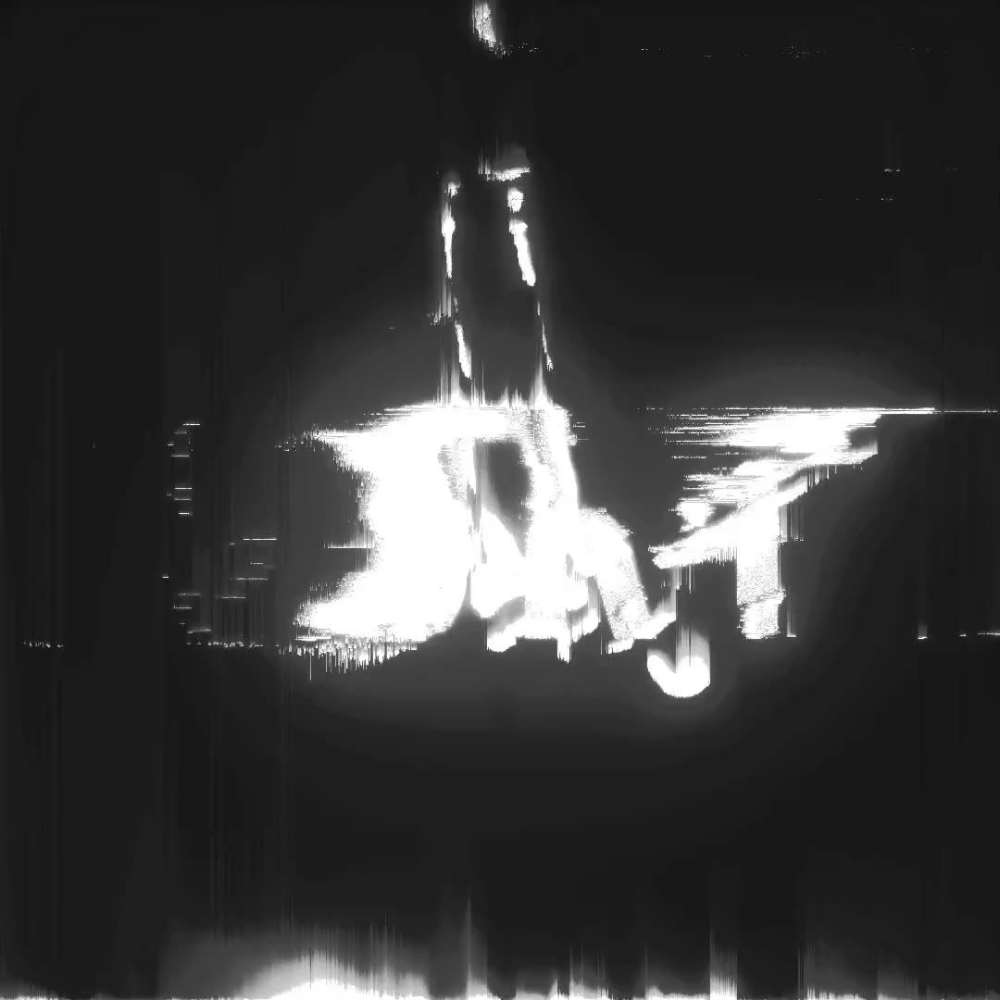

# Pixel Sort TOP — real-time GPU pixel sorting for TouchDesigner (CUDA)

A real pixel sorting algorithm TOP that reorders the pixels along each scanline — row or column — by a per-pixel key, entirely on the GPU. 
The sort style is chosen from a drop-down menu and shaped by a single Amount slider.

## Demo

[](media/pixel-sort-demo.mp4)

▶ **[Play the demo](media/pixel-sort-demo.mp4)** — opens in GitHub's built-in video player.

## Why this one

- **Single-pass.** The whole frame is sorted with one device-wide radix sort over a composite
  key rather than per-row passes, which is where the speed comes from versus typical CPU or
  per-line GPU implementations.
- **Wide hardware support.** Fat binary covering NVIDIA Turing through Blackwell (RTX 20–50).
- **Allocate-once, zero-copy.** Buffers are reused across frames and the texture is read and
  written in place — no per-frame allocations, no host/device transfers.

## Getting the node

The compiled plugin isn't distributed here — precompiled builds are available on **[Gumroad](https://louevoy.gumroad.com)**. To build it yourself, read on.

## Build it yourself

**Requirements:** TouchDesigner 2025.32050+, CUDA Toolkit 12.8+, Visual Studio 2022/2026 (Desktop development with C++), CMake 3.24+, and an NVIDIA GPU (Turing / RTX 20 or newer).

The TD C++ SDK headers (`TOP_CPlusPlusBase.h`, `CPlusPlus_Common.h`) aren't in this repo — they ship with TouchDesigner at `<TD install>/Samples/CPlusPlus/CudaTOP`. Point `-DTD_SDK_DIR` there if your install isn't the default below.

Run from the **x64 Native Tools Command Prompt for VS** (a normal shell won't have `cl`/`nvcc` on `PATH`):

```bat
cmake -S . -B build -G "NMake Makefiles" -DCMAKE_BUILD_TYPE=Release ^
      -DTD_SDK_DIR="C:/Program Files/Derivative/TouchDesigner/Samples/CPlusPlus/CudaTOP"
cmake --build build
```

Copy the built `.dll` from `build\` to `%USERPROFILE%\Documents\Derivative\Plugins\` (or run `cmake --build build --target install_to_td`), restart TouchDesigner, and add the node via **OP Create → Custom → "Pixel Sort"**.
